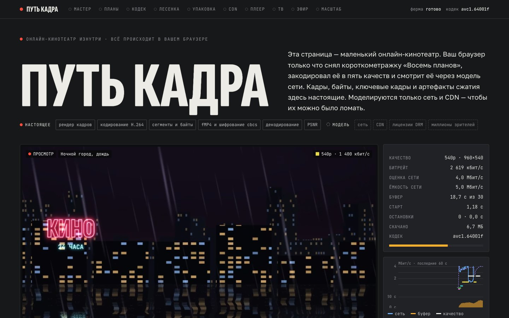

# Путь кадра

> Онлайн‑кинотеатр в одной странице: браузер сам снимает короткометражку, кодирует её в пять качеств, упаковывает, шифрует и смотрит через модель сети и CDN — а десять глав объясняют, как кадр доезжает от мастер‑файла студии до экрана телевизора.

## Как запустить

Двойной клик по `index.html` — сервер и сборка не нужны. Нужен современный браузер с WebCodecs: Chrome или Edge 94+, Safari 16.4+, Firefox 130+ (десктоп). Без WebCodecs страница переходит в модельный режим и честно об этом пишет. Интернет нужен только для шрифтов Google Fonts; без него страница работает на системных шрифтах.

Один файл для публикации (например, как Artifact) собирается командой `node tools/build.mjs` → `dist/frame-journey.html` (без обёртки `<html>`) и `dist/frame-journey.standalone.html` (полный документ).

## Что делать

- **Сеанс.** Плеер уже играет. Переключайте сеть зрителя и ABR‑алгоритм; внизу — пять контрольных мониторов, красный индикатор показывает, какое качество сейчас смотрит плеер.
- **Мастер.** Водите мышью по кадру — лупа покажет Y′, Cb и Cr с субдискретизацией 4:2:0; осциллограф и вектороскоп работают вживую. Калькулятор несжатого видео — внизу.
- **Планы и ферма.** Детектор склеек на живом сигнале и тепловая карта фермы кодирования; «Повторить прогон» проигрывает запись того, как кодировщики заполняли сегменты.
- **Кодек.** Сейсмограф размеров всех кадров, выравнивание ключевых кадров и проверка кодеков вашего устройства.
- **Лесенка.** Эксперимент per‑title / per‑shot запускается сам, когда глава видна: около 160 кодирований и тысячи замеров PSNR на видеокарте. Выбирайте план миниатюрой, двигайте целевое качество.
- **Упаковка и защита.** Байтовая карта настоящего сегмента fMP4, шифрование cbcs по шаблону 1:9, манифесты HLS и DASH, лицензия DRM и A/B‑водяные знаки.
- **Раздача.** Модель CDN на карте городов: предзаливка против LRU, «Премьера в 00:00», отказ узла, склейка запросов.
- **Плеер.** Гонка четырёх ABR‑алгоритмов на одной сети; трассу можно нарисовать мышью; смена устройства меняет буфер и потолок качества.
- **Смарт‑ТВ.** Пульт: стрелки, OK, «Назад». Предзагрузка по фокусу, возраст движков Tizen и webOS, пиксели на градус.
- **Эфир.** Бюджет задержки по этапам и ролик «ГОЛ!» — кто из соседей увидит гол раньше.
- **Масштаб.** Калькулятор «зрители × битрейт», живая строка CMCD, рекорды и то, что ломается первым.

## Что внутри

- **Фильм «Восемь планов»** (`js/10-film.js`): 1536 кадров, 24 к/с, восемь WebGL2‑шейдеров (рассвет, мультфильм, дождь с неоном, поезд, крупный план, архивная плёнка с зерном, огонь) и лидер мастера: полосы SMPTE RP 219, слейт, отсчёт с «2» на одном кадре ровно за 2 с до первого кадра действия.
- **Ферма** (`js/20-farm.js`): пять `VideoEncoder` H.264 (High → Main → Baseline, что поддерживает браузер), VBR, IDR на каждой 2‑секундной границе, прожиг таймкода и номера качества, разность соседних кадров для детектора склеек.
- **Плеер** (`js/32-player.js`): модель сети с RTT и ступенчатой ёмкостью (`js/30-net.js`), планировщик загрузок, буфер, настоящие остановки картинки, `VideoDecoder` с переконфигурацией на границе сегмента, QoE_lin.
- **ABR** (`js/31-abr.js`): Throughput по правилам hls.js (EWMA 3/9 с, запас 0,95/0,7), BBA‑0 (резервуар и подушка), BOLA‑O с параметрами dash.js, RobustMPC (горизонт 5, 5⁵ планов); у каждого — «мысли» для отрисовки.
- **Эксперимент per‑shot** (`js/54-ladder.js`): кодирование с постоянным QP (`bitrateMode: 'quantizer'`), PSNR по яркости после масштабирования к 1280×720 на WebGL2 (массив текстур + float‑редукция), выпуклые оболочки, распределение бит с постоянным наклоном λ.
- **Упаковка** (`js/22-mp4.js`, `js/23-h264.js`): свой мультиплексор CMAF/fMP4 и разбор боксов, разбор SPS/PPS/заголовков слайсов H.264, шифрование cbcs через WebCrypto с картой подвыборок.
- **CDN** (`js/40-cdn.js`): узлы в городах России по настоящим координатам, задержка по расстоянию, каталог по Ципфу, LRU по аппроксимации Че против предзаливки, лавина запросов и склейка.
- Всё остальное — `js/5x-*.js`, по файлу на главу. Факты и ссылки собраны в `docs/research/`, список источников — внизу страницы.

## Проверка

- `node --test tests/*.test.js` — чистая логика: модель сети, ABR, CDN, бюджет задержки, мультиплексор и разбор H.264.
- Мультиплексор и шифрование сверены с ffmpeg: ffprobe читает наши init + сегменты без ошибок, поля заголовков слайсов совпадают с `-bsf:v trace_headers` для каждого слайса, а зашифрованный cbcs‑поток `ffmpeg -decryption_key` расшифровывает бит‑в‑бит (High, Baseline, поток с B‑кадрами). Фикстуры генерирует `tests/fixtures/make-fixtures.sh`.
- Аппроксимация Че сверена с прямой симуляцией LRU.
- Визуально — скриншоты десктопа и телефона через Playwright, 0 ошибок в консоли.

## Почему это про Opus 5.5

Длинная инженерная задача целиком: кодеки, контейнеры, DRM, ABR‑алгоритмы из статей, модели CDN и честный текст со ссылками — и всё это работает в браузере, а не нарисовано.

## Ограничения

- Сеть и CDN — модели: они подписаны на странице, формулы видны. Кодирование, упаковка, шифрование и декодирование — настоящие.
- Лесенка уменьшена под браузер: 180p–720p, 200–2400 кбит/с, только H.264 (браузеры не кодируют HEVC/AV1 массово).
- Качество меряется PSNR, а не VMAF: VMAF в браузере слишком тяжёл; разница объяснена в тексте.
- «Мысли» BOLA упрощены: нет placeholder‑буфера dash.js; стартовая оценка сети у всех алгоритмов одна — 500 кбит/с.
- Профили устройств и задержки подготовки плеера — иллюстративные, но масштаб чисел взят из документации и замеров (Conviva, Samsung, LG).
- Сервис и фильм вымышленные; реальные компании упоминаются только в фактах со ссылками.
